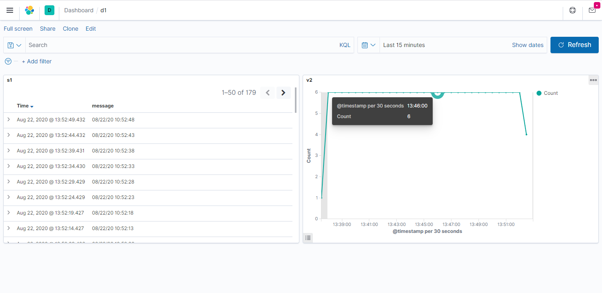

# ELK Stack on Kubernetes Assignment

**Name:** Ariel Popovits

## Components

My implementation contains the following components:

- My App
  - `my-app-elk/` directory (script, Dockerfile, and the Docker image).
  - `resources/my-app-elk-deployment.yaml`
- Filebeat
  - `resources/filebeat-kubernetes.yaml`
- Logstash
  - `resources/logstash-configmap.yaml`
  - `resources/logstash-deployment.yaml`
  - `resources/logstash-service.yaml`
- Elasticsearch
  - `resources/elasticsearch-deployment.yaml`
  - `resources/elasticsearch-service.yaml`
- Kibana
  - `resources/kibana-deployment.yaml`
  - `resources/kibana-service.yaml`

## Installation

1. Load the `my-app-elk` Docker image to the local registry:

   ```bash
   eval $(minikube docker-env)
   docker load < my-app-elk/my-app-elk-image.tar
   ```

2. Apply the resources:
   ```bash
   kubectl apply -f resources/
   ```

## How Filebeat harvests the log file of `my-app-elk`?

In order for Filebeat to be able to read a log file located on another container (in this case - the `my-app-elk` container), we will have to use a **streaming sidecar container**, as officially suggested by Kubernetes:
https://kubernetes.io/docs/concepts/cluster-administration/logging/#streaming-sidecar-container.

A sidecar container is a container that resides in the pod alongside the actual application container, and shares a volume with it. Once it starts, it will `tail` the log file (located on the shared volume) and stream the output to `stdout`.

Filebeat then is configured to harvest the output of the sidecar container.

The sidecar container definition (in `resources/my-app-elk-deployment.yaml`):

```yaml
- name: my-app-elk-sidecar
  image: alpine:3.12
  args: [/bin/sh, -c, 'tail -n+1 -F /var/log/my-app.log 2> /dev/null']
  volumeMounts:
    - name: varlog
      mountPath: /var/log
```

## A simple dashboard in Kibana

The following screenshot shows a simple dashboard I have made (not included in the submission) for the data in Kibana.

The **message** column in the left panel shows the log lines coming from the `my-app-elk`'s log file.

The data pipeline is: `my-app-elk => Filebeat => Logstash => Elasticsearch => Kibana`.


